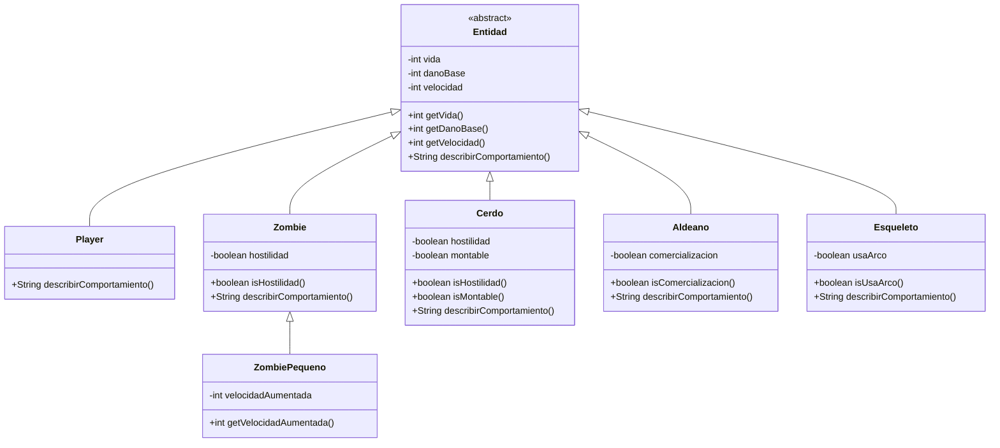

# mr-taller-git-2026

API REST de entidades de Minecraft desarrollada para Lenguaje de Programacion 3.

## Como ejecutar

```bash
./mvnw spring-boot:run
```

La aplicacion queda disponible en `http://localhost:8080`.

## Endpoints

### Estado del servicio

```text
GET /
```

Devuelve un mensaje indicando el autor, el dominio y que el servicio esta funcionando.

### Construccion de un zombie

```text
GET /entidades/zombie?vida=20&danoBase=5&velocidad=3&hostilidad=true
```

Construye un `Zombie` usando los parametros recibidos por URL y devuelve sus datos en JSON.
Los valores se validan en las entidades del dominio.

### Comportamientos

```text
GET /entidades/comportamientos
```

Devuelve en JSON el comportamiento de un `Zombie` y un `Aldeano`. El controller los maneja
como objetos de tipo `Entidad` y cada clase implementa su propio comportamiento.

## Entidades y comportamientos

`Entidad` es la clase abstracta base. Contiene los atributos privados `vida`, `danoBase` y
`velocidad`, valida sus valores en el constructor y declara el metodo abstracto
`describirComportamiento()`.

- `Player`: explora el mundo y combate a las entidades.
- `Zombie`: persigue y ataca al jugador si es hostil; de lo contrario, deambula sin atacar.
- `Aldeano`: comercia con el jugador si tiene comercializacion habilitada.
- `Cerdo`: puede ser montado si tiene esa capacidad habilitada.
- `Esqueleto`: ataca con arco o cuerpo a cuerpo segun su configuracion.
- `ZombiePequeno`: hereda el comportamiento del `Zombie` y agrega una velocidad aumentada.

El estado de las entidades permanece encapsulado: los atributos son privados, no existen
setters publicos y los constructores rechazan valores invalidos.

## Diagrama de clases


